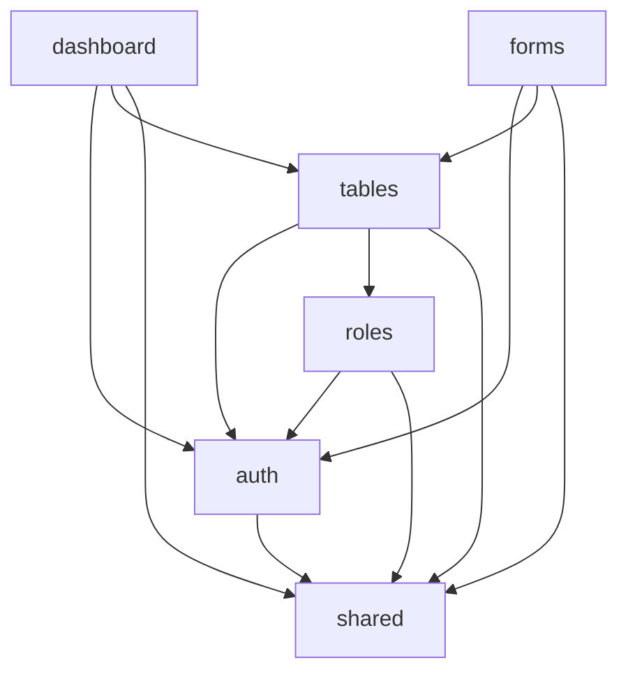

# Project Architecture

## Monorepo Structure

SubZero CLI follows a monorepo architecture using turborepo for efficient package management and development workflow.

```
subzero-cli/
├── packages/
│   ├── cli/                           # Main CLI package (@subzero/cli)
│   ├── modules/
│   │   ├── auth/                      # Authentication module
│   │   ├── roles/                     # Role-based permissions module
│   │   ├── tables/                    # Dynamic table module
│   │   ├── forms/                     # Form builder module
│   │   ├── dashboard/                 # Dashboard widgets module
│   │   ├── files/                     # File upload/management module
│   │   ├── notifications/             # Notification system module
│   │   └── bridge/                    # Inter-module communication (future)
│   └── shared/                        # Shared utilities (@subzero/shared)
├── apps/                              # Example applications (CRM, inventory, etc.)
├── docs/                              # Documentation
├── tools/                             # Build and development tools
├── tests/                             # Integration tests
└── config/                            # Root configuration files
```

## Module Composition

Each module is a complete, self-contained package that includes:

### UI Components
React components that provide the user interface for the module functionality.

```typescript
// Example: @subzero/tables module components
├── components/
│   ├── DataTable.tsx        # Main table component
│   ├── TableFilters.tsx     # Filtering interface
│   ├── TablePagination.tsx  # Pagination controls
│   ├── TableExport.tsx      # Export functionality
│   └── index.ts             # Component exports
```

### Utilities
Helper functions and business logic specific to the module.

```typescript
// Example: @subzero/tables module utilities
├── utils/
│   ├── tableHelpers.ts      # Sort, filter, search helpers
│   ├── exportHelpers.ts     # CSV/Excel export logic
│   ├── validationHelpers.ts # Data validation
│   └── index.ts             # Utility exports
```

### API Routes
Next.js API endpoints that provide backend functionality.

```typescript
// Generated API routes for tables module
├── pages/api/
│   └── [entity]/
│       ├── index.ts         # GET (list), POST (create)
│       └── [id].ts          # GET, PUT, DELETE (single entity)
```

### Database Schemas
Supabase table definitions and relationships.

```sql
-- Example: tables module schema
CREATE TABLE IF NOT EXISTS dynamic_tables (
  id UUID DEFAULT gen_random_uuid() PRIMARY KEY,
  entity_name VARCHAR(255) NOT NULL,
  table_name VARCHAR(255) NOT NULL,
  config JSONB NOT NULL,
  created_at TIMESTAMP WITH TIME ZONE DEFAULT NOW(),
  updated_at TIMESTAMP WITH TIME ZONE DEFAULT NOW()
);
```

### Configuration Schema
JSON schema for module customization and validation.

```json
{
  "$schema": "http://json-schema.org/draft-07/schema#",
  "type": "object",
  "properties": {
    "entity": { "type": "string" },
    "columns": { "type": "array" },
    "features": { "type": "object" }
  }
}
```

### Templates
Files that get generated into user projects when the module is added.

```
templates/
├── pages/
│   └── [entity]/
├── components/
├── api/
└── database/
```

## Generated Project Structure

When users initialize a project and add modules, SubZero generates a clean, organized structure:

```
my-crm/
├── src/
│   ├── modules/                       # All modules live here
│   │   ├── auth/
│   │   │   ├── components/            # Auth UI components
│   │   │   ├── pages/                 # Auth pages (login, signup, etc.)
│   │   │   ├── utils/                 # Auth utilities
│   │   │   └── types/                 # Auth TypeScript types
│   │   ├── tables/
│   │   │   ├── components/            # Table components
│   │   │   ├── hooks/                 # Table-specific hooks
│   │   │   ├── utils/                 # Table utilities
│   │   │   └── types/                 # Table TypeScript types
│   │   └── roles/
│   │       ├── components/            # Role management components
│   │       ├── middleware/            # Permission middleware
│   │       ├── utils/                 # Role utilities
│   │       └── types/                 # Role TypeScript types
│   ├── pages/
│   │   ├── api/                       # API routes from modules
│   │   │   ├── auth/                  # Auth API endpoints
│   │   │   ├── users/                 # Users CRUD endpoints
│   │   │   ├── leads/                 # Leads CRUD endpoints
│   │   │   └── roles/                 # Role management endpoints
│   │   ├── auth/                      # Auth pages
│   │   ├── dashboard/                 # Dashboard pages
│   │   ├── users/                     # Users management pages
│   │   ├── leads/                     # Leads management pages
│   │   └── index.tsx                  # Homepage
│   ├── components/
│   │   ├── common/                    # Shared components
│   │   └── layout/                    # Layout components
│   └── utils/
│       ├── supabase.ts                # Supabase client
│       └── constants.ts               # App constants
├── config/
│   ├── modules/
│   │   ├── auth.json                  # Auth configuration
│   │   ├── tables-users.json          # Users table configuration
│   │   ├── tables-leads.json          # Leads table configuration
│   │   └── roles.json                 # Roles configuration
│   ├── database/
│   │   ├── schemas/                   # Database schema files
│   │   └── migrations/                # Database migrations
│   └── subzero.json                   # Main SubZero configuration
├── styles/
├── package.json
└── next.config.js
```

## Module Dependencies

Modules can depend on other modules, creating a dependency graph:



### Dependency Rules

1. **Shared Module**: All modules can depend on shared utilities
2. **Auth Module**: Required by most modules for user context
3. **Roles Module**: Depends on auth, provides permissions to other modules
4. **Tables Module**: Can work with roles for permissions
5. **Bridge Module**: Future capability for inter-module communication

## CLI Architecture

The CLI follows a command-based architecture:

```
@subzero/cli
├── commands/
│   ├── init.ts              # Project initialization
│   ├── add.ts               # Module addition
│   ├── remove.ts            # Module removal
│   ├── config.ts            # Configuration management
│   ├── deploy.ts            # Database deployment
│   └── dev.ts               # Development server
├── utils/
│   ├── moduleManager.ts     # Module installation logic
│   ├── configValidator.ts   # Configuration validation
│   ├── templateEngine.ts    # File generation
│   └── databaseManager.ts   # Database operations
├── types/
│   ├── module.types.ts      # Module interfaces
│   ├── config.types.ts      # Configuration interfaces
│   └── cli.types.ts         # CLI interfaces
└── index.ts                 # CLI entry point
```

## Build & Development Tools

### Turborepo Configuration
```json
{
  "pipeline": {
    "build": {
      "dependsOn": ["^build"],
      "outputs": ["dist/**"]
    },
    "test": {
      "dependsOn": ["build"]
    },
    "lint": {}
  }
}
```

## Module Communication

### Current: Standalone Architecture
- Modules operate independently
- No direct module-to-module communication
- Shared state through database and auth context

### Future: Bridge Architecture
```typescript
// Future bridge module interface
interface BridgeEvent {
  module: string;
  event: string;
  payload: any;
  timestamp: Date;
}

interface ModuleBridge {
  emit(event: BridgeEvent): void;
  listen(pattern: string, handler: Function): void;
  unsubscribe(pattern: string): void;
}
```

## Package Publishing

Each module is published as a separate npm package:

- `@subzero/cli` - Main CLI tool
- `@subzero/auth` - Authentication module
- `@subzero/tables` - Table module
- `@subzero/roles` - Role-based permissions
- `@subzero/shared` - Shared utilities

This allows for:
- Independent versioning
- Selective module installation
- Smaller bundle sizes
- Easier maintenance

---

**Previous**: [← Overview & Core Philosophy](./01-overview.md) | **Next**: [Quick Start Guide →](./03-quick-start.md) 